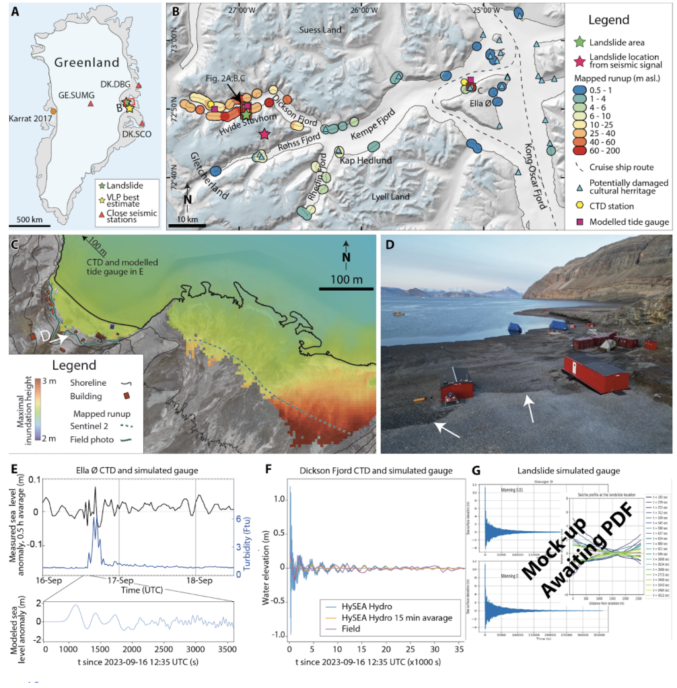

# Figure 1: Seismic source, tsunami observations and modeling

This folder contains the information required to reproduce subplots Fig. 1E-G in the manuscript.

`E\`: [Data from realtime subsea moooring from Greenland Integrated Observatory installed offshore Ella O research station. Data and metadata available via https://doi.org/10.14284/637]

`F\`: [one-sentence description]

`G\`: [one-sentence description]

Subplot A is a standard map. B and C contain runups estimated from manual interpretation of Sentinel 2 satellite images ([sentinel-hub.com](https://sentinel-hub.com)). D is a photograph.
