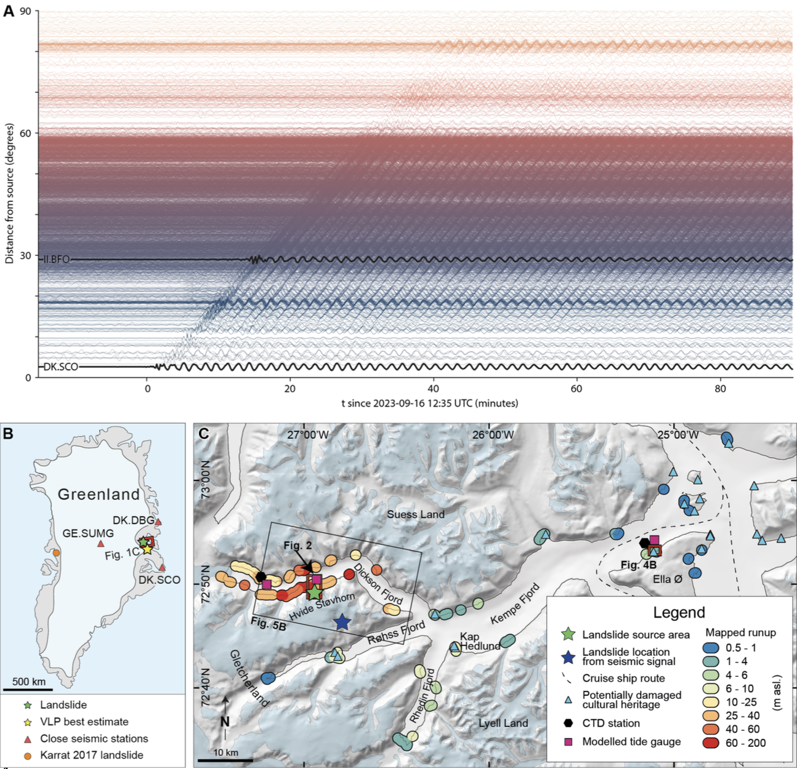

# Figure 1: Seismic source, tsunami observations and modeling

This folder contains the information required to reproduce subplots Fig. 1A-G in the manuscript.

`A\`: [one-sentence description]

`B\`: [one-sentence description]

`C\`: [one-sentence description]

`D\`: [one-sentence description]

`E\`: [one-sentence description]

`F\`: [one-sentence description]

`G\`: [one-sentence description]