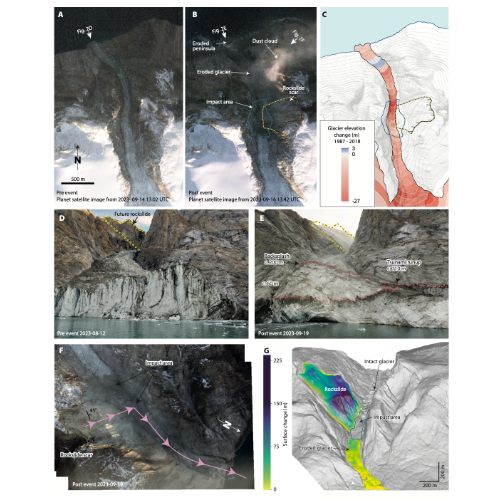

# Figure 2: Landslide observations

This folder contains the information required to reproduce subplots Fig. 2A-G in the manuscript.

`A\`: [one-sentence description]

`B\`: [one-sentence description]

`C\`: [one-sentence description]

`D\`: [one-sentence description]

`E\`: [one-sentence description]

`F\`: [one-sentence description]

`G\`: [one-sentence description]