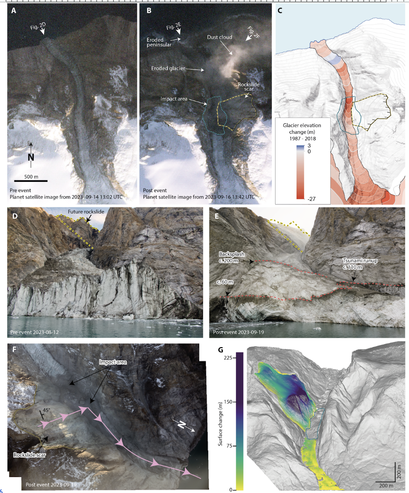

# Figure 2: Landslide observations

This folder contains the information required to reproduce Figure 2 in the manuscript.

`C\`: Glacier elevation change 1987 to 2018

`G\`: Landslide estimation from photogrammetry

The remaining subplots are annotated satellite images retrieved via [www.sentinel-hub.com](https://www.sentinel-hub.com) or photographs.
