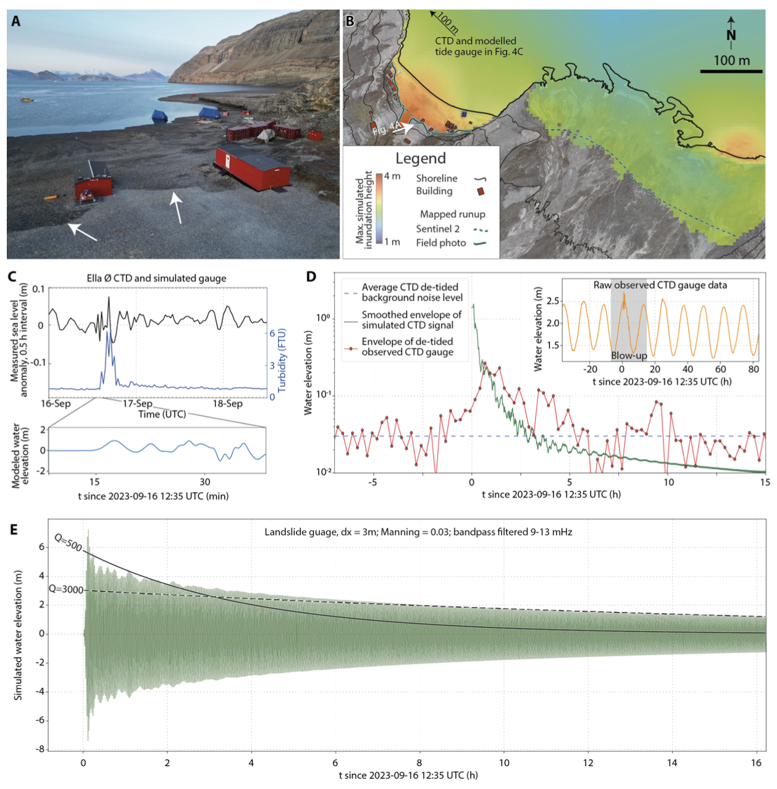

# Figure 4: Tsunami observations and modeling

This folder contains the information required to reproduce Figure 4 in the manuscript.

`B\`: Tsunami propagation model

`C\`: Ella Ø tide gauge and simulations

`D-E\`: Dickson Fjord tide gauge and simulations (HySEA)

Subplot B contains runups estimated from manual interpretation of Sentinel 2 satellite images ([sentinel-hub.com](https://sentinel-hub.com)).