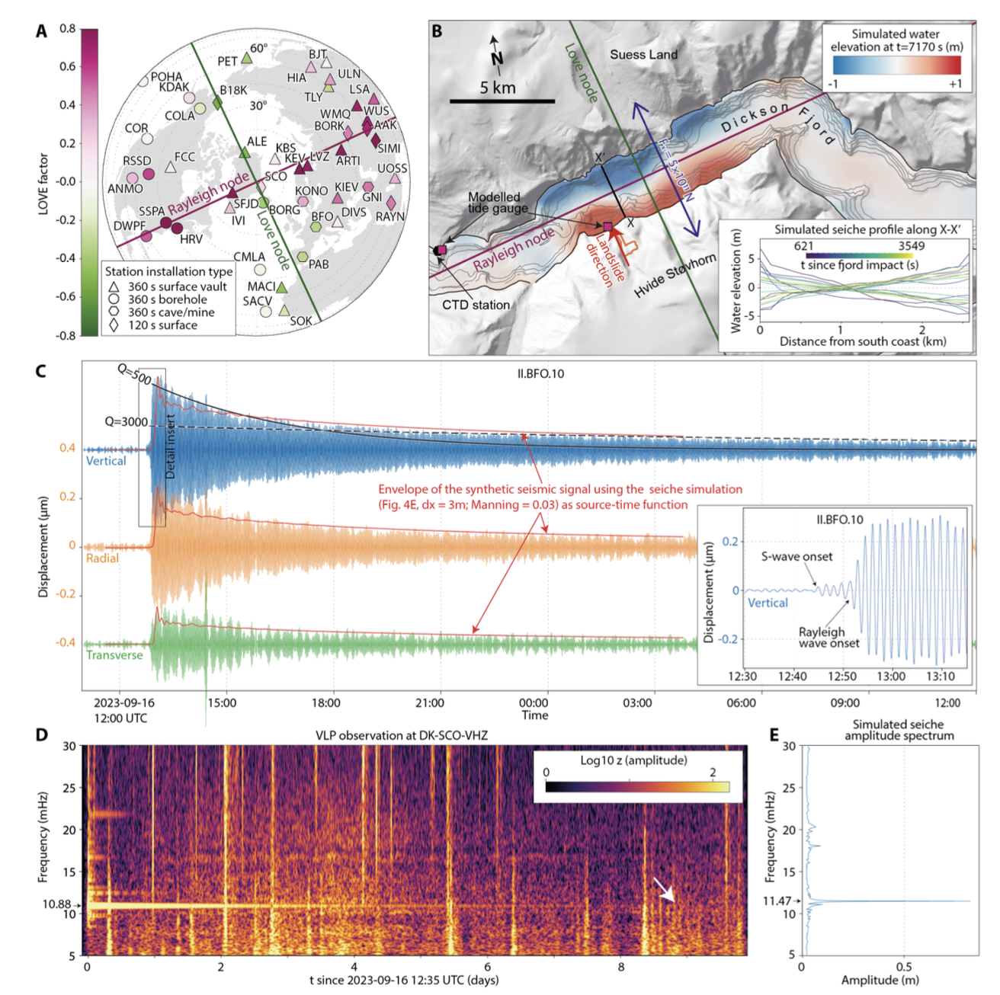

# Figure 5: VLP seismic signal and comparison with simulated seiche

This folder contains the information required to reproduce Figure 5 in the manuscript.

`A\`: Ratio of Love- and Rayleigh-wave-energy (LOVE Factor)

`B\`: Seiche simulation

`C\`: Three-component recording at II.BFO.10 (STS-6A)

`D\`: Vertical component spectrogram at DK.SCO

`E\`: Synthetic seiche spectrogram
